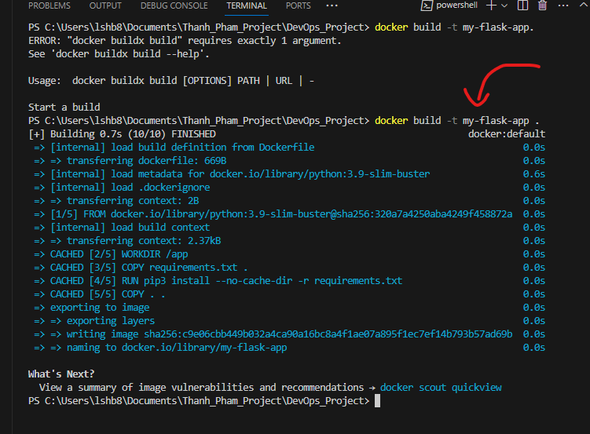
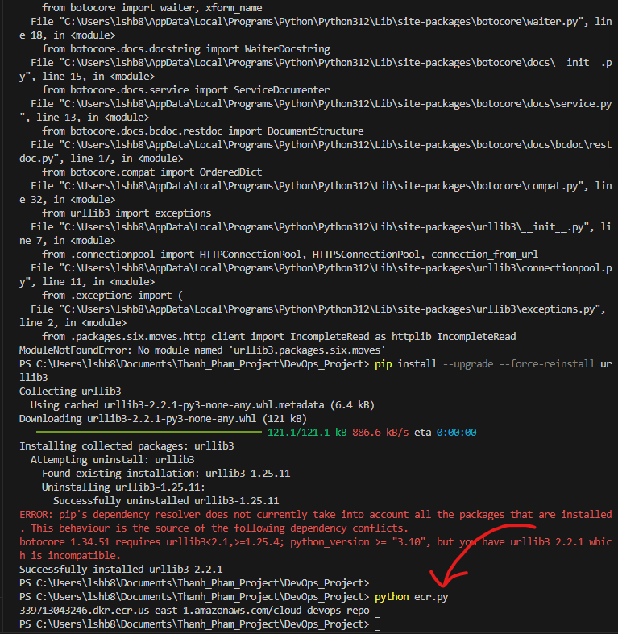

# Cloud Native Resource Monitoring Application

## Introduction

This project outlines the process of creating and deploying a Cloud Native Resource Monitoring Application. It demonstrates the end-to-end development and deployment lifecycle of a Python Flask application, starting from local development to running it in a containerized environment on AWS Elastic Kubernetes Service (EKS).

## Framework

## Tech Stack

- **Python**: A powerful, high-level programming language. It's used here to write our Flask application, providing a simple yet effective backend service.
    - Library Package: See [requirements.txt](requirements.txt) for details.
- **IDE**: Visual Studio Code is recommended for its powerful support for Python and Docker, making it an ideal choice for developing our application.
- **Docker**: Used to containerize the application, ensuring that it runs consistently across different environments.
- **AWS**: Provides a robust cloud platform to host our containerized application, leveraging services like EKS and ECR for orchestration and repository management.
- **Git**: Version control system to manage our application's source code.

## Instructions

### 1. Prerequisites
- AWS account
- AWS CLI, Git installed on your machine
- Python 3
- Docker and Kubectl
- Visual Studio Code

### 2. IAM User Setup
Create an Access Key for your IAM user account on AWS, ensuring you don't use the root account for public projects due to security concerns.

### 3. Install Dependencies
Install all required packages by executing: `pip install -r requirements.txt`

### 4. Flask Application Development
Create a Python script named `app.py` using Flask and psutil for local system monitoring. This script serves as the entry point for the Flask application. 

- **Function**: To define a Flask web application, including its routes and view functions, handling HTTP requests, and generating responses. It also serves HTML files located in the templates folder.

- **Execution**: Run the script using `python app.py` to start the application.

### 5. Dockerize the Application
- **Dockerfile**: Create a Dockerfile to containerize the application, using the image `python:3.9-slim-buster`.
- **Build**: `docker build -t my-flask-app .`
- **Run**: `docker run -p 5000:5000 IMAGE_ID`

**Why Docker?** Containerizing with Docker ensures our application runs consistently across any environment, isolating it from specific system configurations and dependencies.

### 6. Deploy to AWS ECR
- **Repository Creation**: Use boto3 and Python to create a repository on AWS ECR, then push your Docker image using the AWS management console's provided commands.

### 7. AWS EKS Deployment
- **Cluster Creation**: Configure AWS CLI and create an EKS cluster with a node group.
- **Deployment**: Use `python eks.py` to create deployments and services in your EKS cluster.
- **Verification**: Use `kubectl` commands to verify deployments, services, and pods are running as expected.
- **Access**: Expose the service using `kubectl port-forward`.

## Lessons Learned

Through the steps above, we've gained hands-on experience with:
- Developing an application in Python and understanding its deployment process.
- Containerization using Docker to ensure application consistency across environments.
- Deploying and managing applications on AWS EKS, leveraging the power of Kubernetes for orchestration.

## Why Deploy on AWS EKS Instead of Local Hosting?

Deploying applications on AWS Elastic Kubernetes Service (EKS) rather than keeping them running locally offers several key advantages that are critical for scalable, reliable, and secure web applications. Here are the main reasons why moving to AWS EKS is beneficial:

### Scalability
- **Dynamic Scaling**: AWS EKS allows for dynamic scaling of your application. It can automatically adjust the number of instances based on traffic, ensuring that your application remains responsive under varying loads without manual intervention.
- **Resource Optimization**: EKS optimizes the use of underlying resources, ensuring that your application uses just the right amount of compute, memory, and storage resources, reducing waste and lowering costs.

### Reliability and Availability
- **High Availability**: AWS EKS runs on AWS's highly available infrastructure, with data centers in multiple geographic regions and availability zones, ensuring that your services remain available even in the case of a data center failure.
- **Automated Management**: EKS automates tasks such as patching, node provisioning, and updates, reducing the potential for human error and increasing the reliability of services.

### Security
- **Enhanced Security**: AWS EKS integrates with AWS's robust security services, such as IAM for fine-grained access control, VPC for network isolation, and Key Management Service (KMS) for encryption, providing a secure environment for your applications.
- **Compliance**: AWS complies with many security standards and certifications, ensuring that your application meets regulatory requirements.

### Cost-Effectiveness
- **Pay for What You Use**: With AWS EKS, you only pay for the compute and storage resources you use. This can be more cost-effective than maintaining and operating local servers, especially for applications with variable workloads.

### Focus on Development
- **Simplified Operations**: Deploying on AWS EKS simplifies operations, allowing developers to focus on building and improving their applications rather than managing the underlying infrastructure.
- **Ecosystem Integration**: EKS easily integrates with other AWS services and third-party tools, providing a rich ecosystem for monitoring, logging, CI/CD, and more, further enhancing development and operational efficiency.

## Three Environment Deploy Explanation
**Local Machine**:
- **Purpose**: The local machine deployment is typically used for development and testing. It allows developers to quickly write, test, and iterate on their code in a local environment that's easy to set up and use. This step is crucial for initial development phases, where quick feedback and frequent changes are common.
- **Benefits**: Easy setup, quick feedback loop for development, and debugging. Ideal for initial development and testing phases.

**Docker**:
- **Purpose**: Docker deployment takes the application from the local environment and packages it into a container. This container includes all the necessary dependencies the application needs to run. By doing this, the application can be run in any environment that supports Docker, ensuring consistency across different development, testing, and production environments.
- **Benefits**: Ensures consistency across environments, simplifies dependencies management, and facilitates continuous integration and deployment (CI/CD) processes. Docker containers can be easily shared, making it easier to collaborate across teams and deploy to different environments.
  
**AWS EKS (Elastic Kubernetes Service)**:
- **Purpose**: Deploying the application on AWS EKS moves it to a managed Kubernetes service in the cloud. This step is aimed at production deployment, where the application needs to be scalable, highly available, and secure. AWS EKS provides the infrastructure to manage, scale, and deploy containerized applications easily.
- **Benefits**: Scalability, reliability, security, and cost-effectiveness. AWS EKS automates many of the complexities of managing a Kubernetes cluster, allowing teams to focus more on development rather than infrastructure management. It also integrates well with other AWS services for monitoring, security, and compliance.
